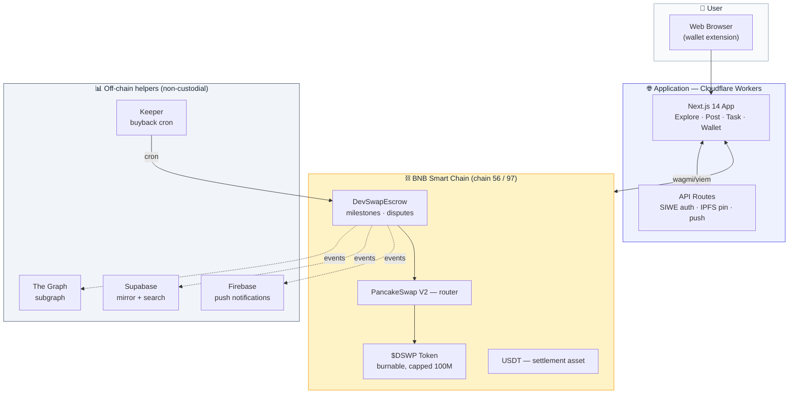

# Architecture

DevSwap is a non-custodial peer-to-peer marketplace for software services on **BNB Smart Chain (BSC)**, settled in **USDT** escrow, with a protocol utility token **`$DSWP`** reduced via a separated **buyback-and-burn** mechanism.

> For source-of-truth order on contract behaviour, see the verified contracts in [`devswap-contracts`](https://github.com/DevSwap-org/devswap-contracts) — the bytecode is the canonical reference; this document is descriptive.

## System diagram (logical)

**Read-vs-write split.** Writes ALWAYS go directly to the smart contract via
the user's wallet. Reads can come from the chain (`viem` direct), the subgraph
(historical, indexed), or Supabase (search/preview only — never a source of
truth). Compromising any off-chain helper cannot move funds because funds only
move on signed transactions.

## Folders (flat layout — see ADR-0001)

| Folder           | Purpose                                                        | Toolchain            |
|------------------|---------------------------------------------------------------|----------------------|
| `contracts/`     | `DevSwapEscrow`, `DevSwapToken`, tests, deploy scripts          | Foundry, OZ v5.1.0   |
| `web/`           | dApp (Vercel root dir)                                          | Next 14, wagmi v2    |
| `subgraph/`      | The Graph indexer                                              | graph-cli, AS/wasm   |
| `keeper/`        | buyback cron                                                   | Node, viem           |
| `notifications/` | FCM HTTP v1 sender                                             | Node (zero-dep)      |
| `supabase/`      | off-chain mirror schema + RLS                                 | Postgres / Supabase  |
| `cloudflare/`    | edge config (SSL, WAF, rate-limit, redirects) via API          | bash + CF API        |
| `docs/`          | architecture, contracts, security, UX, i18n, ADRs              | Markdown             |
| `prompts/`       | role playbooks for repeatable tasks                            | Markdown             |

## On-chain ↔ off-chain boundary

- **On-chain (authoritative):** escrow balances, task state machine, fund
  splits, buyback-burn, ownership. Never trust off-chain state for money.
- **Indexed (read-optimized):** the subgraph projects events into
  `Task`/`User`/`BuybackBurn`/`GlobalStats` for fast list/detail/stat reads.
- **Off-chain (convenience only):** Supabase mirror for search and
  token↔address mapping for per-user push. Treated as a cache; the chain wins.

## Trust model

- Funds custody is the escrow contract only. The frontend, indexer, keeper, and
  Supabase are **non-custodial helpers** — compromising any of them must not move
  funds.
- The keeper can only trigger the already-permissioned buyback path; it cannot
  redirect payouts.
- The `owner` role is limited to safety toggles (pause, auto-buyback enable, slippage) and arbiter-pool parameters, all guarded by `Ownable2Step`. From V2.4+ disputes are resolved by a randomly-drawn 3-arbiter panel, not by the `owner`.

## Data flow: task lifecycle

1. Client posts a task → USDT pulled into escrow (`TaskCreated`).
2. Developer accepts (`TaskAccepted`) → submits delivery (`TaskSubmitted`).
3. Client releases (or timeout) → `FundsReleased`: 97 % dev, 1.5 % fee, 1.5 % buyback (burned inline or deferred). Disputes route through a stake-weighted 3-arbiter panel drawn from `DevSwapArbiterPool`.
4. Subgraph indexes each event; web reads list/detail/stats from it; push
   notifications fire from indexed events (per-user path blocked on Supabase).

See [`CONTRACTS.md`](CONTRACTS.md) for contract-level detail and [`SECURITY.md`](SECURITY.md) for the threat model.
