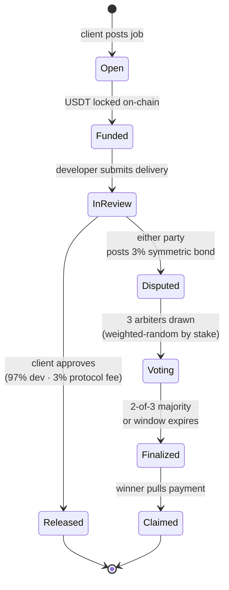
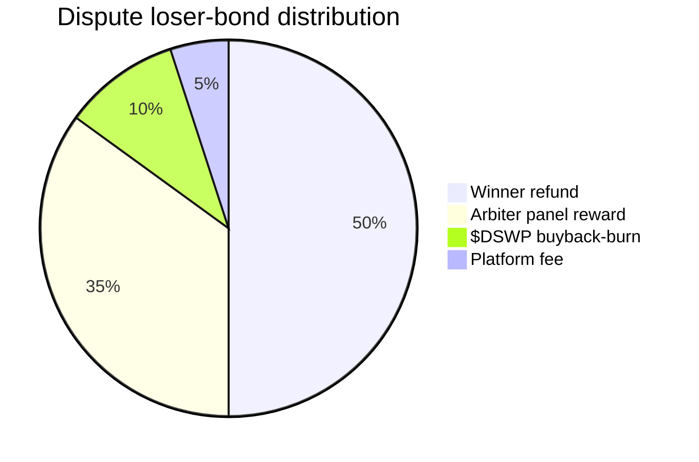
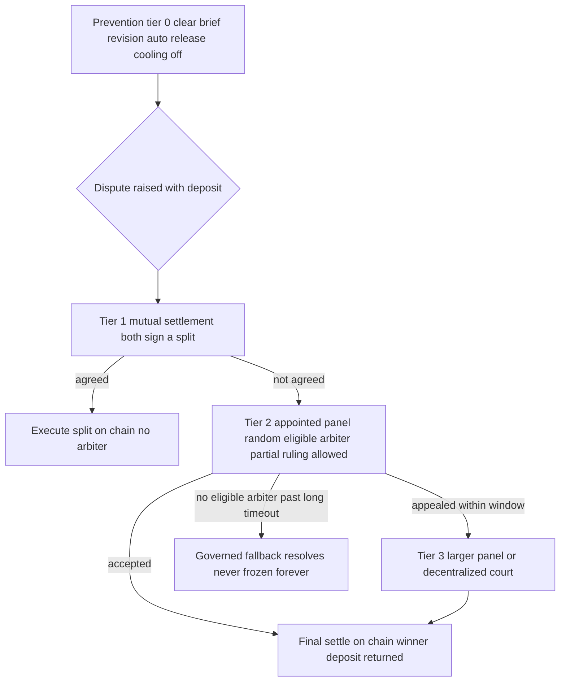

# DevSwap — Dispute Resolution & Arbitration: broad analysis + best-practice roadmap

> **What this is.** A *strategy/design* doc (peer to `SECURITY.md`, `ARCHITECTURE.md`, `RUNBOOK.md`) that
> (1) analyzes the **dispute-resolution design space** broadly, (2) chooses **best practices** for DevSwap's
> non-custodial milestone-escrow context, and (3) lays out a **phased roadmap (A0→A6)** to evolve arbitration
> from today's hardened-but-centralized tier-2 toward a fair, proportionate, decentralizing system.
> **`ADR-0003` is the *current implementation*; this doc is the *forward plan above it*.** It is
> **analysis + plan, not executed code** — every contract change here is future work, **TDD + audit + owner
> ratified** (mainnet stays behind the P5 gate). Specific decisions become their own ADRs when ratified.
> **Companion:** [`TRUST-AND-INCENTIVES.md`](TRUST-AND-INCENTIVES.md) answers the *economic* dispute
> sub-questions this doc defers to A3–A6 — how the arbiter is paid (**loser-funded deposit, NOT the dev's
> 97%**), penalties for a wrong dev/client, the never-frozen fallback, devs-as-jurors — plus
> communication/anti-disintermediation, token demand utility, and decentralized verification.
> **Governance layer:** At G3+, the DAO governs arbiter-pool *policy* (qualification standards, panel size,
> random-draw algorithm) via Tier-2 votes. See [`GOVERNANCE.md`](GOVERNANCE.md) §7 for the full arbitration
> governance design. The A5/A6 staked-random-pool is the governance end-state for arbiter selection.
>
> **Constraints (do not drift):** non-custodial (the smart contract + the parties bear risk, not "we"); fee
> **3% (1.5% platform + 1.5% buyback), dev 97%** (§17); **milestone-only** (ADR-0002); reputation = **public
> itemized counters**; UI copy **§18-safe**; en/ar parity. **Citation:** current state cited by
> `contracts/src/DevSwapEscrowV2_1.sol:NNN` + ADR-0003; competitor facts `[F-N]`/`[U-N]`/source-line; external
> protocols referenced as **well-known mechanism categories** (design reference, not cited specifics — see the
> Evidence basis note); recommendations tagged **design inference / engineering judgment**.

---

## TL;DR

### Lifecycle of a milestone — with and without a dispute

### Where the loser's bond goes (V2.6 — symmetric 3% bond, 4-way split)

> Why this split? It funds the arbiters (35%), partially refunds the winner
> (50%), reduces token supply on every dispute (10%), and keeps the platform
> share minimal (5%). **Both sides post the same bond** so neither party can
> grief the other by raising a frivolous dispute for free.

---

1. **Arbitration is irreducible.** A contract can't judge off-chain work quality → some human/oracle judgment
   is unavoidable. The goal is not to remove the judge but to **minimize how often we need one, make rulings
   fair + cheap, escalate proportionately to stakes, never lose funds, and decentralize the trust over time.**
2. **Today (A0):** hardened tier-2 — appointed arbiter registry, 48h add-timelock, immediate removal, dispute
   snapshot, owner≠judge, binary ruling, public dispute counters (ADR-0003). **Real gaps:** centralized
   appointment, no anti-griefing cost, binary-only, no mutual-settlement path, no arbiter incentive, no appeal,
   a "frozen-forever" edge, no on-chain revision loop.
3. **Best practice = prevention-first + proportionate escalating tiers** (Tier 0 automated → 1 mutual
   settlement → 2 appointed panel → 3 decentralized/optimistic), scaled to the amount at stake.
4. **Roadmap A0→A6** turns each gap into a TDD-built, audit-gated, owner-ratified phase, decentralizing the
   appointment power last (owner→multisig→governance).

---

## 1. The irreducible problem

Escrow disputes hinge on a **subjective question about off-chain artifacts** — did the GitHub/IPFS delivery
meet the agreed brief? A smart contract **cannot** read and grade that; it can only enforce *objective*
conditions (timeouts, balances, who-may-act). So **every** escrow marketplace needs an off-chain judgment
source. The design problem is therefore not "can we automate the verdict" (we can't) but:

- **WHO** renders the judgment, **HOW** they're selected, **WHAT** keeps them honest, **HOW** the loser is
  stopped from gaming it, **HOW** finality is reached, and **WHAT** happens at the failure edges.

Design goals (in priority order, conservative-first): **(1) never mis-pay or lose funds** → **(2) resolve
fairly** → **(3) resolve cheaply + fast** → **(4) minimize how often a human is needed** → **(5) decentralize
the trust over time.**

## 2. Where DevSwap is today (A0 baseline)

**Shipped (ADR-0003 + `DevSwapEscrowV2_1`):**
- Tier-2 **appointed arbiter registry**; **owner ≠ judge** (`_checkArbiter` [:201]); **48h add-timelock**
  (`queueArbiter`/`executeArbiter` [:345]/[:353]); **immediate removal** [:371]; **dispute snapshot**
  (`arbiterSince <= disputeRaisedAt` [:324]) blocks puppet-judge insertion; **binary ruling**
  (`resolveDispute(payDeveloper)` [:320]); **public counters** `disputesRaised`/`disputesLost` [:69]; auto
  paths (`claimMilestone` auto-release; `cancelMilestone` for unaccepted/timed-out); RUNBOOK **≥3-arbiter**
  policy.

**Honest gaps (what "best practice" must add):**

| # | Gap | Why it matters |
|---|-----|----------------|
| G1 | **Centralized appointment** — owner picks arbiters; on testnet the sole bootstrap arbiter = the deployer | the main remaining trust point; not yet decentralized |
| G2 | **No cost to raise a dispute** | enables griefing/extortion-by-dispute (stall settlement) |
| G3 | **Binary ruling only** ([:320]) | unfair for partially-delivered work (no split) |
| G4 | **No mutual-settlement path** | forces an arbiter even when parties could agree a split cheaply |
| G5 | **No arbiter incentive / no stake** | honesty rests on appointment trust + reputation only — no skin-in-the-game |
| G6 | **No appeal** | a single wrong ruling is final |
| G7 | **"Frozen-forever" edge** (ADR-0003 §4) | a fully de-arbitered open dispute can be permanently unresolvable |
| G8 | **No on-chain revision loop** | one submission per milestone; client's only recourse to "almost right" work is release-anyway or dispute |
| G9 | **No conflict-of-interest / assignment rules** | an arbiter could (in a multi-arbiter future) self-select favorable cases |

## 3. The design space (broad analysis)

### 3.1 WHO decides — the five archetypes

| Model | How it works | Pros | Cons | Fits DevSwap when |
|-------|--------------|------|------|-------------------|
| **Operator-judge** (Fiverr Resolution Center [F-14] / Upwork mediation [U-36]) | the platform decides | simple, fast | single trusted party, opaque — the thing DevSwap exists to avoid | never (anti-thesis) |
| **Appointed neutral panel** *(current A0)* | owner/governance registers trusted arbiters | resilient vs key-compromise (hardened), human nuance | trusted appointment; centralization | small/medium jobs, bootstrap phase |
| **Staked random jury** (Kleros-style) | random jurors stake a token, vote, Schelling-point incentives + appeals | trust-minimized, censorship-resistant | slow, costly, bribe/whale risk, overkill for small jobs | high-value / appealed cases |
| **Optimistic assert-challenge** (UMA-optimistic-oracle-style) | a proposed outcome stands unless challenged in a window; only challenges escalate to a vote | cheap in the common (uncontested) case | needs a challenge incentive + escalation court | medium cases; the default escalation gate |
| **Algorithmic / structural** *(partly shipped)* | deterministic rules: timeouts, auto-release, milestone granularity | zero human, zero cost | only objective conditions, never quality | the non-dispute path (already in use) |

### 3.2 The other axes (briefly)

- **Selection:** owner-appointed (now) · staked+random · reputation-weighted · governance-elected · curated
  list + random subset (anti forum-shopping).
- **Incentives (the hard part):** honesty must be the dominant strategy — via **stake + slashing** (minority
  loses), **arbitration fee** (paid by loser), **public arbiter track-record** (overturn rate). *DevSwap A0
  has none — arbiters are unpaid, unstaked appointees (G5).*
- **Finality:** single-ruling-final (now) vs **bounded appeal** (one escalation, appeal deposit) vs unbounded
  (Kleros-style, expensive). Best practice = **one bounded appeal**.
- **Granularity:** **binary** (now, G3) vs **partial/split** (award X% dev / rest client) — fairer for
  half-done work, but adds an arbitrary-split surface to guard.
- **Evidence:** off-chain (IPFS) hash-anchored on-chain; **submission window**; optional **commit-reveal**
  votes (anti-herding) for panel/jury tiers.

### 3.3 Failure modes / attack vectors (design against all)

| Vector | Mitigation (current → target) |
|--------|-------------------------------|
| Owner-key compromise inserts puppet judge | **already mitigated** — separation + 48h timelock + snapshot (ADR-0003) |
| Arbiter collusion / bribery | random assignment, stake/slashing, public track-record, appeal (A3/A4/A6) |
| Arbiter unavailability → frozen dispute | ≥3-arbiter policy now; **no-permanent-freeze fallback** (A5) |
| Frivolous/extortion disputes (G2) | **dispute deposit** refundable to winner + reputation flag (A3) |
| Cost > value (decentralized court on a $50 gig) | **value-proportional escalation** — don't over-engineer small jobs (A6) |
| Sybil/whale capture of a juror pool | staking economics + curated+random selection (A6, if tier-3) |
| Evidence-timing / last-mover games | bounded evidence window + commit-reveal (A3) |

## 4. Best practices chosen for DevSwap

Ordered; each tagged with the gap it closes. *(design inference / engineering judgment.)*

1. **Prevention before resolution** — most disputes should never reach a human:
   - structured brief on IPFS = the scope-of-truth; **milestone granularity** limits blast radius;
   - a **first-class revision request** (re-open a submission for a bounded re-submit count) so dispute is the
     *last* resort, mirroring Fiverr/Upwork revision-first (`fiverr.md:3443`, `upwork.md:2179`) — **closes G8**;
   - **review-window auto-release** (shipped) handles client-ghosting without an arbiter;
   - **dispute cooling-off** (UX-9) to stop rage-disputes.
2. **A cost to dispute (anti-griefing, G2):** raising a dispute posts a **small refundable deposit**, returned
   to the **winner**; a serial frivolous loser also takes a public reputation flag. Discourages
   extortion-by-dispute. §18-safe (it's a stake, not a custodial fee).
3. **Tier-1 mutual settlement (G4):** `proposeSettlement(split)` / `acceptSettlement` — if **both** parties
   sign a split, it executes **with no arbiter**. The cheapest fair resolution; most contested-but-reasonable
   cases end here.
4. **Partial / split rulings (G3):** let an arbiter award a **percentage** (e.g., 60% dev / 40% client),
   bounded to sum 100%, for partially-delivered work. Fairer than all-or-nothing.
5. **Arbiter incentive + public track-record (G5):** an **arbitration fee** (paid by the loser, or a small
   slice) and/or **stake + slashing**; plus a **public arbiter record** (cases, overturn-on-appeal rate). Skin
   in the game + transparency.
6. **One bounded appeal (G6):** the losing party may escalate **once**, within a window, with an **appeal
   deposit**, to a **larger/different** panel (or the tier-3 court); otherwise the ruling is final. Fairness
   without endless litigation.
7. **No-permanent-freeze fallback (G7):** for a dispute with **no eligible arbiter** past a long timeout
   (e.g. 30–60d), a **governed** last-resort resolves it (multisig-appointed emergency arbiter via a special
   audited path, or a conservative default = return-to-client). Removes the "stuck forever" edge **without**
   reopening the puppet-judge hole.
8. **Random assignment + conflict-of-interest rules (G9):** assign from the eligible ≥3 panel
   pseudo-randomly; an arbiter **cannot** rule on own/related-party jobs. Anti forum-shopping.
9. **Radical transparency:** every ruling = a **public tx** with the evidence hash + reason code; arbiter
   identities + track-records public; aggregate dispute stats public (subgraph). Leans on the reputation MOAT.
10. **Value-proportional escalation:** **don't** force expensive decentralized arbitration on tiny gigs —
    scale the mechanism (and its cost) to the amount at stake.
11. **Decentralize the appointment power itself:** owner-EOA → **multisig** → (eventually) token/DAO
    governance of the arbiter registry. The appointment key is a trust vector; shrink it over time.

## 5. Target architecture — proportionate tiered resolution

**Escalation is value-proportional:** a small Gig resolves at Tier 0/1 almost always; only larger or appealed
contracts reach Tier 2/3, where the higher cost is justified by the stakes.

## 6. Phased roadmap (A0 → A6)

> Each phase: **goal · contract/UX/governance delta · gates · ADR?**. All contract work = TDD (unit/fuzz/
> invariant + attack scenarios) + slither + en/ar + §17/§18; **independent audit + owner→multisig before
> mainnet** (P5). Order is by impact-per-risk; A1–A2 are cheap + high-impact, A4/A6 are the heavy economic/
> decentralization lifts.

| Phase | Goal | Delta | Gate / ADR |
|-------|------|-------|-----------|
| **A0** ✅ | hardened tier-2 (current) | done (ADR-0003) | shipped |
| **A1 — Prevention** | cut the dispute *rate* | on-chain **revision request** (bounded re-submit, G8); dispute **cooling-off** (UX-9); evidence-pointer surfacing | UX + light contract; **ADR-0010** (revision loop) |
| **A2 — Mutual settlement (Tier 1)** | resolve most contests with no arbiter (G4) | `proposeSettlement`/`acceptSettlement` (both-sign split) | contract; audit; **ADR-0011** |
| **A3 — Fair + anti-griefing Tier 2** | fairer, harder to game (G2,G3,G9) | **dispute deposit** (refund winner); **partial/split ruling**; evidence window; random assignment + conflict rules | contract; audit; **ADR-0012** |
| **A4 — Arbiter incentives** | align honesty (G5) | arbitration **fee** and/or **stake+slashing**; public arbiter track-record | economic design; careful audit; **ADR-0013** |
| **A5 — No-permanent-freeze** | remove the stuck-forever edge (G7) | governed emergency-resolution path past a long timeout (multisig path, snapshot-safe) | contract; audit; **ADR-0014** |
| **A6 — Decentralized escalation + governance** | trust-minimize (G1,G6) | **bounded appeal** → **Tier-3** (Kleros-style jury or UMA-style optimistic oracle, value-gated); registry governance owner→multisig→DAO | research + integration; audit; **ADR-0015** |

**Dependency notes:** A1/A2 are independent + safe → do first. A3 builds the fair tier-2 most cases will use.
A4 (economics) and A6 (decentralization) are the largest; sequence after the cheaper wins prove the funnel.
A5 can land any time after A3. **None ships to mainnet without the P5 audit + multisig gate.**

## 7. Gaps → fix traceability

`G1`→A6 · `G2`→A3 · `G3`→A3 · `G4`→A2 · `G5`→A4 · `G6`→A6 · `G7`→A5 · `G8`→A1 · `G9`→A3.

## 8. Risks, honesty & evidence basis

- **The hard truth:** arbitration is the **main remaining centralization** in DevSwap. The A0 hardening
  defends against *owner-key compromise*, **not** against a legitimate arbiter's *bad judgment* — that is
  mitigated only by panel + reputation + appeal + (eventually) decentralization. Even "decentralized" courts
  have known weaknesses (bribery, whale capture, cost). Full trustlessness here is a **journey**, not a switch;
  this roadmap is honest about that.
- **Non-custodial / §18:** all rulings move funds via the **contract**, not "us"; no custody/guarantee/refund
  wording in any user-facing copy this work would add; "escrow" stays in technical prose only.
- **Restates shipped (not inference):** the A0 baseline (§2) is read from `DevSwapEscrowV2_1` + ADR-0003.
- **Design inference / engineering judgment (labeled):** §3 archetype fit, §4 best practices, §5 target tiers,
  §6 roadmap + the ADR-0010..0015 numbering (reserved, not yet written), all timeout/deposit/% values
  (illustrative, to be set per-ADR with tests).
- **External protocols** (Kleros, UMA optimistic oracle, Aragon Court) are referenced as **well-known
  mechanism *categories*** for design orientation — **not** cited specifics; any integration (A6) requires its
  own up-to-date due-diligence + audit before adoption. Competitor facts carry `[F-N]`/`[U-N]`/source-line.
- **Status:** analysis + plan only. **No contract code changed.** Each phase is owner-ratified (its ADR) and
  audit-gated; mainnet remains behind P5 (audit + owner→multisig + timelock).
