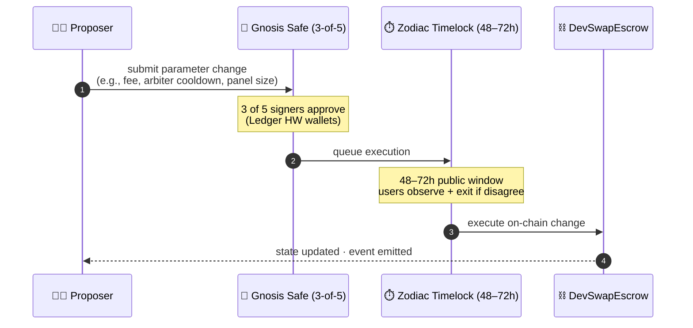
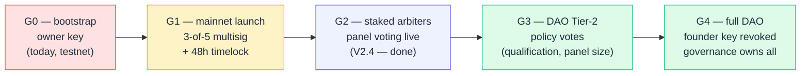

# DevSwap Protocol — Decentralization & DAO Governance Roadmap

- **Status:** Design document — ratified direction; reserved ADR slots for the technical spec.
- **Relates to:** the arbiter-hardening decision record ([`ADR-0003`](adr/ADR-0003-arbiter-hardening.md)), the non-custodial positioning decision record ([`ADR-0006`](adr/ADR-0006-non-custodial-positioning.md)), and the project's internal arbitration roadmap, incentive design, and tokenomics planning documents. Public-facing security posture: [`SECURITY-AUDIT.md`](SECURITY-AUDIT.md).
- **Reserved ADRs:** the DAO governance architecture (ADR-0019) and Governor-contract parameters (ADR-0020) — drafted on ratification of this roadmap.

> **Security Gates context.** Every phase below is conditional on the protocol-level Security Gates documented in [`SECURITY-AUDIT.md §1`](SECURITY-AUDIT.md) — Mythril CI, Slither, ≥ 95 % test coverage, the 412-test suite across 20 Foundry suites (automated, all green), independent third-party audit, multisig + timelock, and qualified-counsel review (manual, pending). G1 mainnet launch cannot proceed before Gates 5 – 7 close.

---

## 1. Vision — Platform as Protocol, Not Company

DevSwap's long-term goal is to make the platform **genuinely ungovernable by any single party** —
including its founders. The smart contract is already the enforcement layer (ADR-0006). The next step
is to make all *parameter changes* and *policy decisions* go through transparent on-chain governance
that token holders control.

This is not a whitepaper promise. It is a phased engineering and legal programme. The phases are
sequenced to protect users during the early, fragile period and surrender control progressively as
the system proves itself.

### How a parameter change reaches production (target: G2 onward)



**Why a timelock matters.** The window between Safe-approval and on-chain
execution is the user's escape hatch. If a proposed change is hostile, users
have time to withdraw their open milestones before it takes effect. The
protocol's hardcoded floors (e.g. the **immutable 3% fee cap**) close off the
worst hostile changes entirely — they cannot be proposed at all.

### Decentralization phases (G0 → G4)



---

## 2. Why Full Decentralization?

### 2.1 Liability posture (the primary driver)

A platform that can unilaterally change rules, appoint judges, or freeze funds is a custodian in
most legal frameworks — and therefore a regulated financial intermediary. A protocol where:

- Rules are enforced by code only (ADR-0006 — already done)
- Parameter changes require a public DAO vote + timelock (this doc)
- No single key can swing an active dispute (ADR-0003 — already done)
- The founder's key eventually has no special power (G4 target)

…is much closer to neutral infrastructure than a company offering financial services. Genuine
decentralization is the strongest available shield against platform-level liability for individual
dispute outcomes.

### 2.2 Trust without intermediation

The escrow is non-custodial. But arbiters are currently appointed by the owner. That is a
residual trust bottleneck — users must trust the owner to appoint honest arbiters. Progressive
decentralization moves arbiter policy to community governance and, eventually, arbiter selection
to on-chain random draw, removing the need to trust any individual.

### 2.3 Token utility / demand

A governance token with real voting power over real protocol parameters is a **stronger consumptive
sink** than a pure boost-credit token: developers and clients who want to shape the platform's
rules — fee levels, dispute timeouts, arbiter standards — need to hold $DSWP and participate. This
is utilitarian demand, not speculative demand.

**Securities note:** governance tokens where holders profit from cash flows = likely securities.
$DSWP governance is over *protocol parameters of a utility service*, and token holders receive **no
share of fee revenue** (fees go to operational costs + buyback-burn, never redistributed). This is
the safe framing; counsel must confirm before G3 launch.

---

## 3. Current State (G0) and the Honest Gap

| Dimension | G0 today | G4 target |
|---|---|---|
| Contract owner | Single EOA (testnet) | Timelock controlled by DAO Governor |
| Arbiter appointment | Owner queues (48h) / removes (instant) | DAO votes on *policy* + pool standards; contract draws randomly |
| Fee parameters | Owner-settable | DAO Tier-2 vote (7-day timelock) |
| Protocol upgrades | Owner deploy + users migrate | DAO Tier-3 supermajority (14-day timelock) |
| Emergency pause | Owner | Guardian multisig (2-year sunset) |
| Dispute policy | Owner + ADRs | DAO governance |
| LP / treasury | Owner multisig | DAO treasury + guardian co-sig |

**The honest gap:** G0 → G4 is a 2–3 year journey. Premature claims of decentralization without
the substance is the legal and reputational risk. Every phase below must be *actually completed*
before claiming that phase's properties.

---

## 4. Phased Roadmap (G0 → G4)

### G0 — Current: Owner EOA (testnet)
*State today.* Owner key controls everything. Acceptable on testnet; **never acceptable on mainnet.**
The P5 gate (audit + multisig + timelock + LP lock) is the prerequisite before any mainnet launch.

### G1 — Mainnet launch: Owner → 3-of-5 Multisig + 48h Timelock (P5 gate)
Already planned in P5. No single key controls the contract. The 48h timelock on the Multisig ensures
every parameter change is visible on-chain before execution. This is the **minimum viable
decentralization** for mainnet.

- Technical change: `transferOwnership` to a `TimelockController` whose proposer/executor is the
  Gnosis Safe 3-of-5.
- Already designed: ADR-0003 §2 (48h arbiter timelock) works the same way.
- Does **not** require any token or Governor contract.

### G2 — Token launch: $DSWP distributed + ERC20Votes activated (post-GMV)
After GMV is proven and the protocol utility token meets the validate-first gate, the token
contract is upgraded to include `ERC20Votes` (snapshot-based voting power). No Governor yet — just
making the token governance-ready.

- The `DevSwapToken` contract gets `ERC20Votes` extension.
- Token holders can begin delegating voting power to themselves or others.
- No on-chain proposal mechanism yet; feedback is off-chain (Snapshot.org or forum).
- This phase establishes the **delegation habit** before it has on-chain consequences.

### G3 — DAO governance: Governor contract deployed (≥6 months post token-launch)
A `DevSwapGovernor` (OpenZeppelin Governor) is deployed with a 3-tier timelock structure (§6).
The Guardian multisig (3-of-5) retains an emergency veto for the first 2 years.

- DAO controls Tier-1 and Tier-2 parameters (§5.1, §5.2).
- The Multisig no longer controls parameters directly — it can only veto, not propose.
- First real governance vote: ratify the fee structure and the arbiter-pool policy.
- **Arbiter policy** (who qualifies, minimum panel size, random-draw mechanism) becomes a DAO vote.
  Individual arbiter *appointments* remain admin-executed but must conform to DAO-ratified policy.

### G4 — Full decentralization: Guardian sunset (≥12 months post G3, by community vote)
The Guardian veto is removed via a DAO Tier-3 supermajority vote (75% of quorum). From this point:

- No single human entity has any special on-chain power.
- Contract upgrades require DAO Tier-3 vote + 14-day timelock.
- The platform website is the only centralised residual (hosting, domain). Goal: IPFS-hosted
  frontend with ENS domain as the final decentralisation step (out-of-scope of this doc, future).

---

## 5. What the DAO Governs

### 5.1 Tier 1 — Protocol Parameters (low sensitivity)

**Active V2.4 Dispute Engine Parameters — Tier-1 Governance Adjustable:**

| Setter | Parameter | Default | Hard Ceiling | Effect |
|--------|-----------|---------|--------------|--------|
| `setDisputeFeeBps(uint256)` | `disputeFeeBps` | 300 (3%) | 1000 (10%) | Scales the per-dispute deposit linearly with milestone size |
| `setDisputeBounds(uint256 min, uint256 max)` | `minDisputeDeposit` / `maxDisputeDeposit` | 15 USDT / 150 USDT | `max ≤ 10,000 USDT` ; `min ≤ max` | Floor protects arbiter compensation; ceiling protects user capital |
| `setMinWorkHistoryTasks(uint256)` | `minWorkHistoryTasks` | 3 | unbounded | Sybil gate floor for gated-value jobs (V2.3) |
| `setGatedJobThreshold(uint256)` | `gatedJobThreshold` | 500 USDT | unbounded | Above this milestone amount, the Sybil gate applies (V2.3) |
| `setDevReputationStakePercent(uint256)` | `devReputationStakePercent` | 100 (1%) | 1000 (10%) | Developer's reputation-lock at job approval (V2.3) |
| `setSlashBps(uint256)` (Arbiter Pool) | `slashBps` | 500 (5%) | 1000 (10%) | Stake slashed from non-voting arbiters, sent to `burn()` |
| `setVotingWindow(uint256)` (Arbiter Pool) | `votingWindow` | 7 days | [1, 30] days | Maximum dispute-panel voting window |
| `setArbiterPool(address)` (V2.4 Escrow) | `arbiterPool` | (set at deploy) | n/a | Plug-in upgrade path for Arbiter Pool versions |

All setters pass through the Tier-1 Timelock (48h) under the DAO Governor after the G3 phase. They
are individually `onlyOwner` until ownership is transferred to the timelock.


**Timelock: 48h | Quorum: 2% circulating | Voting period: 3 days | Simple majority**

- Dispute timeout duration (currently: 30 days)
- Dispute deposit amounts (floor and ceiling)
- Milestone review window
- Arbiter-pool minimum size policy (currently: ≥3)
- Promoted-slots-per-page cap and multiplier ceiling (protocol incentive design, C.2)
- Reputation-floor requirements for boosts
- Token sink prices (visibility boost, priority queue cost in $DSWP)

### 5.2 Tier 2 — Economic Parameters (medium sensitivity)
**Timelock: 7 days | Quorum: 4% circulating | Voting period: 5 days | Simple majority**

- Platform fee percentage (the 1.5% owner slice) — adjustable within 0%–3% hard bounds
  (the 97% floor and the total 3% cap are **immutable**)
- Buyback-burn trigger threshold (minimum reserve before executeBuybackBurn)
- Slippage tolerance on buyback swaps
- Arbiter-pool qualification standards (on-chain work-history minimums, reputation score floor)
- Auto-burn-on-spend toggle for $DSWP sinks (on/off, not destination — destination = always burn)
- `feeRecipient` address (the operational wallet that receives the 1.5% platform fee)

### 5.3 Tier 3 — Structural Changes (high sensitivity)
**Timelock: 14 days | Quorum: 8% circulating | Voting period: 7 days | 75% supermajority**

- Contract upgrades (if proxy pattern adopted)
- New contract integrations (e.g., adding a Layer-3 decentralised jury module)
- Guardian sunset (voluntary early removal of the 2-year veto)
- DAO treasury withdrawals above a set threshold
- Adding or removing $DSWP token sink types
- Any change to the `ERC20Votes` snapshot mechanism

### 5.4 Immutable Floors — Governance Cannot Touch These

These are enforced at the Solidity level, not by governance convention. No proposal can change them.

| Invariant | Value | Why immutable |
|---|---|---|
| Developer minimum share | **≥ 97%** of milestone | Core user promise; reducing it = bait-and-switch |
| Total fee ceiling | **≤ 3 %** of milestone | Competitive positioning; raising it breaks the headline promise |
| `burn()` destination | Token contract's own burn function | `address(0)` fails with OZ v5; immutable in contract |
| CEI pattern + ReentrancyGuard | Always active | Removing it = exploitable in one block |
| Emergency pause capability | Always available to Guardian | Without it, a bug can drain all funds with no recourse |
| Dispute snapshot rule | `arbiterSince <= disputeRaisedAt` | ADR-0003 — closes the puppet-arbiter hole |

---

## 6. Technical Architecture

### 6.1 ERC20Votes Extension on $DSWP

Add `ERC20Votes` to `DevSwapToken.sol` (Phase G2). This adds:

- **Checkpointing:** historical balance snapshots at each block so votes are counted against the
  balance *at the time of proposal creation*, not current balance. Closes the flash-loan-governance
  attack (buy tokens → vote → sell tokens in one block).
- **Delegation:** token holders call `delegate(address)` to self-delegate or delegate to a
  representative. Undelegated tokens have **zero voting power** — this is the standard OpenZeppelin
  pattern. UI must prompt users to delegate on wallet connect.
- **`DOMAIN_SEPARATOR`** for EIP-712 permit-style delegation.

**Securities note on ERC20Votes:** voting power ≠ financial return. Governance over utility
parameters of a utility service is not revenue sharing. The token does not grant claims on fees or
earnings. Counsel must confirm this framing before G2 activation.

### 6.2 DevSwapGovernor Contract

Based on `OpenZeppelin Governor` (GovernorBravo-compatible). Deployed in G3.

```solidity
contract DevSwapGovernor is
    Governor,
    GovernorSettings,
    GovernorCountingSimple,
    GovernorVotes,
    GovernorVotesQuorumFraction,
    GovernorTimelockControl
```

Three separate `TimelockController` instances (one per tier) are the targets of governance
proposals. The Governor routes each proposal to the appropriate timelock based on the target
contract + function selector.

**Proposal threshold:** 0.1% of total supply must be held (or delegated) to create a proposal.
Prevents spam governance. Adjustable by Tier-2 governance vote.

**Voting delay:** 1 day (gives delegates time to organize before voting starts).

### 6.3 TimelockController — Three Tiers

| Tier | Delay | Controls | Min Quorum |
|---|---|---|---|
| T1 | 48h | Protocol parameters (§5.1) | 2% |
| T2 | 7 days | Economic parameters (§5.2) | 4% |
| T3 | 14 days | Structural changes (§5.3) | 8% + 75% supermajority |

Each `TimelockController` has:
- **Proposer role:** the Governor contract only (proposals must pass a vote to queue)
- **Executor role:** anyone (permissionless execution after delay, gas incentive)
- **Canceller role:** the Guardian multisig only (can cancel during the delay window)

### 6.4 Guardian — Emergency Multisig (Sunset at G4)

The Guardian is the same 3-of-5 Gnosis Safe + Ledger HW wallets used at P5 mainnet launch.

**Guardian can:**
- Cancel any queued proposal during its timelock window (veto)
- Pause the Escrow contract (emergency response to a discovered exploit)
- Unpause the Escrow (if paused, requires Guardian 3-of-5 OR DAO Tier-2 vote — whichever comes
  first, to prevent Guardian from holding the protocol hostage)

**Guardian cannot:**
- Execute any state change directly (no proposer role in timelocks after G3)
- Override a DAO vote once it has been executed (timelock is irreversible post-execution)
- Change the immutable floors (§5.4)

**Sunset clause:** The Guardian veto expires automatically 2 years after G3 launch, OR by a DAO
Tier-3 supermajority vote, whichever comes first. After sunset, the canceller role on all
timelocks is set to `address(0)` — no one can cancel, only the timelock delays stand.

---

## 7. Governance Over Arbitration

This is the most politically sensitive governance domain and deserves its own section.

### 7.1 What the DAO governs (arbiter policy, not individual judges)

The DAO votes on **policy**: minimum panel size, qualification criteria, on-chain reputation
minimums, the random-assignment mechanism. The DAO does NOT vote to appoint or remove individual
arbiters — that remains an admin function executed within the DAO-ratified policy.

**Why:** Direct DAO appointment of individuals creates a popularity-contest dynamic where large
token holders lobby for their preferred arbiters. Separating *policy* (DAO) from *execution*
(admin-within-policy) keeps judicial selection neutral.

### 7.2 Long-term: DAO-governed staked-random-pool (A5/A6 roadmap)

In the protocol's internal arbitration roadmap (stages A5/A6), arbiter selection eventually moves to a
**staked-random-pool** (Kleros-style): any qualified token holder stakes $DSWP to enter the pool;
the contract draws randomly weighted by stake for each dispute; the drawn arbiter judges, and is
rewarded (from the loser's deposit) or slashed (for ignoring a dispute or being overturned on
appeal).

This is governance's end-state for arbitration: the *policy* (stake minimums, random draw
algorithm, appeal mechanics) is a DAO Tier-2 vote; the *execution* is the contract itself with no
human discretion. **No person appoints anyone.** The DAO sets the rules; the contract draws the
panel.

**Dependency:** This requires the arbiter-stake ADR-0013 and legal review of stake-to-work
framing before building (see the protocol's incentive design, Fork 5).

### 7.3 What governance cannot do to arbitration

- Cannot retroactively reassign an already-open dispute (snapshot rule is immutable — §5.4)
- Cannot force a ruling outcome
- Cannot remove an arbiter mid-dispute (ADR-0003 §4 — option A ratified)
- Cannot reduce the arbiter removal to anything other than immediate

---

## 8. DAO Treasury

### 8.1 Funding source

The DAO treasury is funded from **token allocation** (a portion of the initial $DSWP distribution),
not from fee revenue. This is the securities-safe model: the treasury is a community grant pool,
not a profit-sharing mechanism.

The 1.5% platform fee (feeRecipient wallet) covers operational costs (hosting, graph node, legal,
audits, keeper gas). Surplus operational fees may be directed to the DAO treasury by a Tier-2 vote
of the multisig, but this is **not automatic** and is not promised at token launch.

### 8.2 What the DAO treasury funds

- Security audits (ongoing, post-P5)
- Bug bounty payouts
- Development grants for open-source contributors
- Legal fund for regulatory clarity filings
- Ecosystem grants (integrations, tooling, translation)

### 8.3 What the DAO treasury does NOT do

- Pay dividends or distribute revenue to token holders
- Fund speculative investments
- Pay individual arbiters (arbiter pay = loser's dispute deposit, not treasury)

---

## 9. Platform Liability Posture Under Full Decentralization

When G4 is reached, the liability posture shifts fundamentally:

| Question | Answer under full DAO governance |
|---|---|
| Who decides fee rates? | DAO vote, on-chain, transparent |
| Who appoints arbiters? | Admin executing DAO-ratified policy; eventually: the smart contract via random draw |
| Who can change the rules? | Any $DSWP holder with ≥0.1% supply, via public proposal + vote |
| Who controls the treasury? | DAO Tier-3 vote |
| Who can pause the contract? | Guardian only (and Guardian is sunset; after G4: no one) |
| Who is liable for a bad dispute outcome? | The arbiters' on-chain reputation; the DAO-ratified policy — no single legal entity |

**The claim we can honestly make at G4:**
> "DevSwap is a protocol governed by its community of token holders. No individual, company, or
> foundation has unilateral authority over its rules. The smart contract enforces outcomes; the DAO
> sets the parameters by public vote; and no entity — including the original developers — can
> override a completed transaction."

**The claim we cannot make until G4:**
> "DevSwap is fully decentralized." (G0–G3 = partially centralized, transitioning. Premature
> decentralization claims are the main legal risk in this space.)

---

## 10. The Honest Limits of Decentralization

1. **The UI is centralised.** The website `devswap.pro` is hosted on Cloudflare/Vercel. A domain
   seizure or hosting takedown removes the primary user interface. The contract remains accessible
   via direct RPC calls, but that is not user-friendly. IPFS + ENS frontend is the long-term answer
   (out of scope now).

2. **Legal compliance is not decentralisable.** KYC/AML obligations in certain jurisdictions apply
   to the *interface* even if the protocol is neutral. The DAO cannot vote to legally exempt the
   platform from applicable law. This is handled by geo-blocking and the non-custodial framing
   (ADR-0006), not by decentralisation alone.

3. **Token concentration = governance concentration.** If the top 10 wallets hold 60% of $DSWP,
   governance is de facto centralised regardless of the on-chain mechanism. The token distribution
   design (team vesting and community allocation in the protocol's tokenomics plan) must produce genuine dispersion. This
   is a social/distribution problem, not a technical one.

4. **"Sufficiently decentralized" is not a bright legal line.** The SEC's analysis is fact-specific
   and evolving. Reaching G4 does not guarantee regulatory immunity. Counsel is required before
   claiming decentralization as a legal defense in any jurisdiction.

5. **Arbitration is the last residual centralization.** Even at G4, individual arbiters are humans
   making judgment calls. The DAO governs their selection and standards; it cannot govern their
   individual reasoning. The only trustless alternative is algorithmic resolution (Tier-0 automated)
   for simple cases, and even that has its limits.

---

## 11. Phased Implementation Checklist

### G1 (P5 gate — prerequisite for mainnet)
- [ ] Deploy `TimelockController` (48h, proposer = Gnosis Safe 3-of-5, executor = Gnosis Safe)
- [ ] `transferOwnership(address(timelock))` on Escrow + Token contracts
- [ ] Smoke-test: a governance action (e.g., `setFeeRecipient`) goes through Safe → Timelock → execute
- [ ] `RUNBOOK.md` updated with multisig procedures
- **Gate:** independent audit (P5) must pass before mainnet deploy

### G2 (post-GMV, parallel to $DSWP launch)
- [ ] Add `ERC20Votes` to `DevSwapToken.sol` + tests (fuzz voting power after transfers)
- [ ] Legal review: counsel confirms ERC20Votes governance framing is not a security
- [ ] UI: delegation prompt on wallet connect ("Activate your vote")
- [ ] Off-chain governance forum (Snapshot.org or equivalent) for soft signaling

### G3 (≥6 months post token launch, ≥1 month after G2 stable)
- [ ] Deploy `DevSwapGovernor` + 3× `TimelockController` (T1/T2/T3)
- [ ] Audit of Governor + Timelocks (separate from P5 audit)
- [ ] Transfer timelock admin from Gnosis Safe to Governor (Safe retains canceller = Guardian)
- [ ] First DAO proposal: ratify current fee structure + arbiter-pool policy
- [ ] `docs/RUNBOOK.md` updated with DAO proposal procedures
- [ ] ADR-0019 formally authored and accepted

### G4 (≥12 months post G3, by community supermajority vote)
- [ ] DAO Tier-3 vote to sunset the Guardian (set canceller to `address(0)`)
- [ ] IPFS frontend deployment + ENS domain claim (stretch goal)
- [ ] Final legal review confirming "sufficiently decentralized" posture
- [ ] Public announcement: "DevSwap governance is fully on-chain"

---

## 12. Connection to Existing Decisions

| Prior decision | How governance integrates |
|---|---|
| Arbiter-hardening decision record (ADR-0003) | Arbiter-pool *policy* moves to DAO Tier-2; individual appointments remain admin-executed within policy; snapshot rule is immutable |
| Non-custodial positioning (ADR-0006) | Governance strengthens this: no governance vote can make the protocol custodial |
| Hybrid-funding decision record (ADR-0009) | Funding mode defaults and timeout windows = Tier-1 governance |
| Protocol incentive design (Fork 1 – 7) | All 7 forks are Tier-1 / Tier-2 governance parameters post-G3; bootstrap values are ratified now via ADR |
| Validate-first tokenomics | The protocol utility token is not launched until GMV is proven; governance activation follows token launch (G2), not before |
| Security Gates (P5) | G1 is the P5 gate. G1 must pass independent audit + multisig + counsel review before mainnet. |

---

## 13. Reserved ADRs

- **ADR-0019** — DAO Governance Architecture (this document's technical spec when ratified)
- **ADR-0020** — Governor contract parameters (quorum fractions, voting periods, proposal threshold)

---

## Evidence basis & honesty note

- **Mechanism references:** OpenZeppelin Governor (GovernorBravo-compatible), `TimelockController`,
  `ERC20Votes` — all are well-established OZ v5 contracts with extensive battle-testing.
  Integration requires up-to-date audit; references here are for orientation, not cited specifics.
- **Legal framing:** "Sufficiently decentralized" references the Hinman 2018 framework and common
  Web3 legal practice. This is legal orientation, not legal advice. **Counsel required at G2 and
  G4.**
- **Competitor references:** Uniswap DAO, Compound Governor, Aave governance — referenced as well-known mechanism categories, not endorsed or cited as binding precedent.
- **Status.** Analysis + design only. No contract code changed. All phases are governance-ratified (their ADRs) and, where applicable, audit-gated. Mainnet remains behind the gates in [`SECURITY-AUDIT.md §1`](SECURITY-AUDIT.md).
