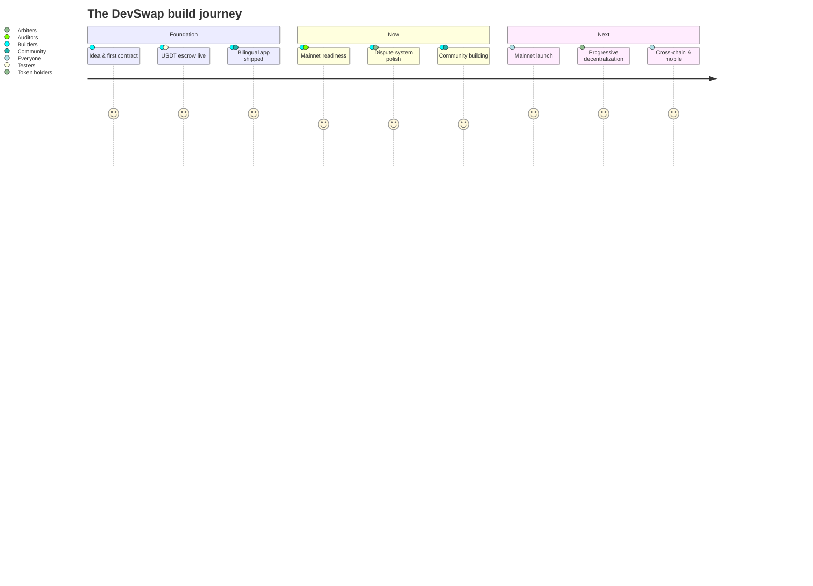
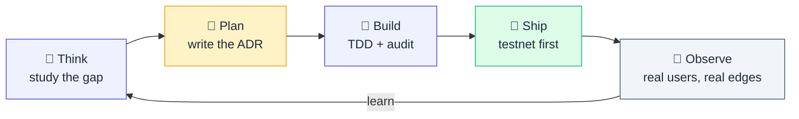

# Roadmap

> **DevSwap is built in public, by iteration.** We ship a layer, watch how
> it lands with real users on testnet, learn, and ship the next layer better.
> No promises with dates — promises with **direction** and the discipline to
> keep moving. This page is the honest record: what already works, what we
> are building right now, and where we are heading next.

---

## 🌱 Foundation — what we already shipped

The protocol you can use today on BNB Smart Chain testnet. Every item here is
**live, verifiable on-chain, and covered by automated tests + a documented
audit cycle**.

### Smart contracts

- **USDT-denominated escrow** with milestone settlement — funds locked
  on-chain at acceptance, released on the client's approval, never custodied
  by a company.
- **Dispute panel (V2.4)** — a randomly-drawn panel of staked arbiters votes
  by majority within a fixed window; either party can raise a dispute by
  posting an equal bond.
- **Symmetric-bond economics (V2.6)** — both sides pay the same dispute
  bond; the loser's bond splits 50% to the winner, 35% to the arbiter
  panel, 10% to a `$DSWP` buyback-and-burn, and 5% to the platform.
  Removes the asymmetry that lets one party grief the other for free.
- **Buyback-and-burn separated from settlement** — every successful job
  routes 1.5% to buy `$DSWP` on PancakeSwap V2 and burn it. The burn
  retries on the next keeper tick if the swap fails, so a market hiccup
  never blocks the developer's payout.
- **`$DSWP` utility token** — ERC-20, hard-capped at 100M, burnable, with
  no staking or yield by design. Reduction-only deflationary mechanism.
- **Hardened arbiter pool** — minimum stake floor, weighted-random
  selection, cooldown on unstake while disputes are open, removable by
  governance, never by a single key alone.

### Engineering

- **Audited end-to-end** — Mythril symbolic execution as a CI hard gate,
  Slither static analysis green, 401 unit/fuzz/invariant tests across 19
  suites with 98%+ line coverage on the settlement contract and 100% on
  the token.
- **Cloudflare Workers deployment** — the app and API serve from the edge
  in 200+ cities. Static caching tuned per-route, security headers (HSTS,
  CSP, COOP, CORP, Permissions-Policy) set at the edge.
- **The Graph subgraph** indexing every escrow + dispute + arbiter event,
  so the UI and partner integrations can query historical state without
  trusting any single off-chain database.
- **Bilingual product from day one** — Arabic (RTL, Tajawal) and English
  (LTR, Inter), full parity on 385 i18n keys, professionally translated
  user-facing copy.

### Trust & process

- **Public docs site** at docs.devswap.pro with the architecture, dispute
  resolution design, tokenomics, governance roadmap, and every
  Architecture Decision Record (ADR) we have written.
- **Independent security disclosure** policy (RFC 9116) with a triage
  inbox and a public security audit report.
- **Code-doc consistency** enforced in CI — a fee change in the contract
  fails the build unless the matching i18n strings, README, runbook, and
  audit doc all update together. The protocol cannot drift from its
  documentation.
- **Legal-safe positioning** — every user-facing string is scanned for
  custodial vocabulary; the smart contract is always the actor, never
  "we".

---

## 🔄 Now — what we are actively building

This is the work in flight as you read this. None of it is a date promise;
all of it is being shipped **piece by piece, with the same audit + test
discipline as the foundation**.

### Mainnet readiness

- **Third-party security audit** by an established Web3 firm — preparing
  the engagement package (contracts, threat model, prior audit notes,
  proof-of-coverage artifacts) so the auditor starts at speed.
- **Multisig + timelock** — moving owner permissions from a single key to
  a 3-of-5 Gnosis Safe with a 48–72 hour Zodiac timelock. Once live, every
  parameter change is publicly observable for two days before it takes
  effect — users can exit if they disagree.
- **Qualified-counsel review** of the user-facing copy, token disclosure
  interstitial, and arbitration mechanics for the jurisdictions we expect
  early users from.
- **Liquidity locking** — preparing the `$DSWP` liquidity provision plan
  with an 18–24 month lock on PinkLock, so day-one liquidity cannot be
  pulled. Public proof of lock will be published with mainnet launch.

### Product polish

- **Dispute experience** — refining the arbiter inbox, vote panel, and
  outcome-claim flow based on observed friction on testnet. Every micro-
  copy passes the legal-safe scan; every state transition has both an
  English and Arabic narration.
- **Mobile** — collapsing the desktop nav into a bottom tab bar, shorter
  chain labels, tighter wallet drawer. Already shipped in the latest UI
  cycle and being tightened further as we see real touch interaction.
- **Profile & reputation** — public, itemized counters (jobs completed,
  approval rate, dispute outcomes) live today; refining the way they
  surface in search and proposals.

### Communications & community

- **This documentation site** — adding professional infographics, keeping
  every diagram in sync with the live deployment, scrubbing internal
  vocabulary from the public surface so external readers get the
  *protocol*, not the engineering chatter.
- **Onboarding flow** — a one-page "how it works" for first-time clients
  and developers, focused on the moment-of-funding decision and the
  dispute-fallback safety net.
- **Open weekly build log** — recording what shipped each cycle in a
  format outsiders can follow without engineering background.

---

## 🚀 Next — where we are heading

Direction, not deadlines. Each phase below depends on the previous one
landing cleanly. We **never ship the next layer until the current one is
live, tested, and observed under real load**.

### Phase: Mainnet launch

The first cycle where real USDT moves through real escrow. Conditions for
this phase to start: every gate in *Now → Mainnet readiness* must close,
including the independent audit, the multisig + timelock cutover, counsel
sign-off, and a live LP lock.

When it starts, we will:

- Publish the mainnet escrow address, `$DSWP` contract, and arbiter pool
  with full BscScan verification.
- Open the first cohort of arbiters with a public stake-and-apply flow.
- Run the first month with conservative parameter ceilings, observed
  closely, and adjusted only through the timelock window.

### Phase: Progressive decentralization

Hand the keys to the protocol back to the people who use it.

- **Tier-1 governance** — token-holder votes (with quorum + delay) over
  protocol parameters that already have hardcoded floors (fee ceiling,
  timelock minimum, arbiter cooldown range).
- **Tier-2 governance** — arbiter-pool policy (qualification standards,
  panel size, random-draw algorithm) governed by DAO vote.
- **Founder-key revocation** — at the final phase, the owner key is sent
  to a burn address. The protocol becomes ungovernable by any single
  party, including its founders. The roadmap to this moment is in
  [`GOVERNANCE.md`](GOVERNANCE.md).

### Phase: Reach & utility

- **Mobile native** — iOS and Android apps with wallet-connect, push
  notifications for milestones and disputes, biometric approval for
  release transactions.
- **Cross-chain** — extending the escrow to additional EVM chains
  (Polygon, Base, Arbitrum) once the core contract is audited and stable
  on BNB Smart Chain mainnet. Reputation portability is the design goal.
- **Consumptive `$DSWP` sinks** — opt-in, capped, merit-floored boosts
  (developer visibility, client request priority, marketing packs).
  Spent `$DSWP` is burned, never recycled.
- **Fiat ramps** — partnerships at the wallet/aggregator layer so clients
  funding their first job don't have to leave the flow to get USDT. KYC
  happens at the on-ramp, never in the protocol.

### Phase: Beyond the marketplace

If the foundation, mainnet, and decentralization phases land well, the
same primitives — non-custodial milestone escrow, transparent disputes,
burned platform fees — generalize beyond software. Adjacent markets we
have studied and are interested in: design services, audio production,
translation work, structured consulting engagements. Each would arrive as
its own community-led layer on top of the same audited core.

---

## How we build

Every loop produces an Architecture Decision Record. The ADRs are public
in [`adr/`](adr/) — you can read the trade-off we considered, the
alternative we rejected, and the reasoning that picked the option we
shipped. This is the discipline we follow: **decisions are written down
before they are executed, and the writing stays public after the code
goes live**.

---

## Where to look next

- The current state of the contracts: [`CONTRACTS.md`](CONTRACTS.md)
- Why disputes work the way they do: [`DISPUTE-RESOLUTION.md`](DISPUTE-RESOLUTION.md)
- The token's role and burn mechanics: [`TOKENOMICS.md`](TOKENOMICS.md)
- The full path to a DAO: [`GOVERNANCE.md`](GOVERNANCE.md)
- The full audit posture: [`SECURITY-AUDIT.md`](SECURITY-AUDIT.md)
- The architecture decisions log: [`adr/`](adr/)
