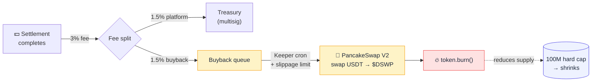

# DevSwap Token — `$DSWP` Tokenomics

> Comprehensive reference for the DevSwap utility token `$DSWP`: contract,
> economics, value mechanism, distribution, operations, and securities-safe
> framing. **Every number and behaviour is sourced from the on-chain code** —
> no estimates.
>
> Network: BNB Smart Chain · Settlement asset: USDT · Token: `$DSWP`.

---

## 0. TL;DR

- `$DSWP` is a standard **ERC-20 utility token** on BSC — not a payment asset
  and not an investment instrument.
- Settlement and escrow happen entirely in **USDT**. `$DSWP`'s only job is to
  have its supply **reduced** in proportion to protocol activity.
- **Max supply: 100,000,000** (hard cap, can never be exceeded).
- **Value mechanism:** every successful settlement routes **1.5%** to buy
  `$DSWP` from PancakeSwap and burn it (buyback-and-burn) → activity-linked
  supply contraction.
- **Strategic posture:** the token launch is *validate-first* — the protocol
  runs on USDT-only commissions until real demand is proven.
- **Securities-safe framing:** no staking, no yield, no farming, no price
  promise — by design.

> **Future utility (post-launch):** consumptive sinks (developer visibility
> boost, client request priority, marketing packs) are described in
> [`TRUST-AND-INCENTIVES.md` — Area C](TRUST-AND-INCENTIVES.md). Boosts are
> a multiplier on merit (not a replacement), capped, labelled "Funded", with
> a reputation floor; the spent `$DSWP` is **burned automatically** and the
> burn is never marketed as a return.

### Buyback-and-burn cycle — every settlement reduces supply



**Key property:** the burn is *separated* from the developer payout. If the
PancakeSwap swap fails (no liquidity, slippage breach), the developer's 97%
still settles immediately — the buyback retries on the next keeper tick.
Settlement reliability is decoupled from market conditions.

---

## 1. What `$DSWP` is — and is not

| Is | Is not |
|---|---|
| An ERC-20 (BEP-20) utility token | A payment / settlement asset (settlement is USDT) |
| A deflationary instrument via burns | An investment or yield instrument |
| Burnable via `burn()` | Mintable above the hard cap |
| Owned via `Ownable2Step` (becomes multisig) | Single-key controlled on mainnet |

**Why isn't it used for payment?** Price stability for both sides (client and
developer) requires a stable settlement asset → USDT. Using a volatile asset
for escrow exposes both parties to price risk during the work. The two roles
are deliberately separated: **stability for settlement (USDT)** and
**deflation for the token (`$DSWP`)**.

---

## 2. Token contract — [`DevSwapToken.sol`](https://github.com/DevSwap-org/devswap-contracts/blob/main/src/DevSwapToken.sol)

Deliberately small (34 lines), Solidity `=0.8.24`, OpenZeppelin v5.1.0 (vendored).

```solidity
contract DevSwapToken is ERC20, ERC20Burnable, ERC20Capped, Ownable2Step
```

### Specs

| Property | Value | Purpose |
|---|---|---|
| Name / symbol | `DevSwap` / `DSWP` | ERC-20 identity |
| Decimals | 18 | Standard ERC-20 |
| Hard cap `MAX_SUPPLY` | `100_000_000e18` | Hard ceiling on `totalSupply` |
| `ERC20Capped` | — | `totalSupply` **never** exceeds the cap, even after burn-and-remint |
| `ERC20Burnable` | — | Enables the escrow to burn what it buys via `burn()` |
| `Ownable2Step` | — | Two-step ownership transfer (prevents lost-to-wrong-address) |

### Functions

| Function | Authority | Behaviour |
|---|---|---|
| `constructor(initialOwner)` | — | Sets name/symbol/cap/owner. **Mints nothing** — `totalSupply` starts at zero |
| `mint(to, amount)` | `onlyOwner` | Mints up to the cap; fails via `ERC20Capped` if exceeded |
| `_update(...)` | `internal override` | Resolves the diamond-inheritance conflict between `ERC20` and `ERC20Capped` |

> **Key point:** burns are executed via `ERC20Burnable.burn()` on tokens the
> contract holds — **not** by transferring to `address(0)` (OpenZeppelin ERC20
> reverts on zero-address transfers).

---

## 3. Economics

**Max supply: 100,000,000 `$DSWP`** — distributed across four buckets. Numbers
match the constants in the distribution script `DistributeToken.s.sol`:

| # | Bucket | Share | Amount | Destination | Mechanism |
|---|---|---:|---:|---|---|
| 1 | Activity & trading mining | **50%** | 50,000,000 | `ACTIVITY_DISTRIBUTOR` (defaults to `TREASURY`) | Incentives for active developers |
| 2 | Liquidity pool (launch) | **25%** | 25,000,000 | `TREASURY` | Locked LP on PancakeSwap paired with USDT |
| 3 | Team & development | **15%** | 15,000,000 | `VestingWallet(TEAM_BENEFICIARY)` | **Linear vesting** (4 years default) |
| 4 | Community rewards (airdrop) | **10%** | 10,000,000 | `AIRDROP_DISTRIBUTOR` | Active GitHub developers |
| | **Total** | **100%** | **100,000,000** | | Script asserts `totalSupply == 100M` |

### Team vesting

- The team's 15M is minted to an OpenZeppelin **`VestingWallet`** with linear release.
- Start: `TEAM_VEST_START` (defaults to deploy time) · Duration:
  `TEAM_VEST_DURATION` (default `4 * 365 days`).
- Linear release across the full period — no cliff in the current configuration
  (adjustable via env before deploy).

---

## 4. Value mechanism — Buyback & Burn (the heart of the economy)

The token derives value not from a price promise but from
**activity-linked supply contraction**:

```
Successful settlement (USDT) ──► 97% to the developer + 1.5% to the operator (instant)
                                      │
                                      └─► 1.5% USDT ──► buy $DSWP on PancakeSwap ──► burn() ──► lower supply
```

### Distribution math (the `_payout` function)

On USDT with **18 decimals** (BSC USDT is 18 decimals, not 6 like on Ethereum):

```solidity
fee          = amount * FEE_BPS     / BPS_DENOMINATOR   // 150/10000 = 1.5%
buyback      = amount * BUYBACK_BPS / BPS_DENOMINATOR   // 150/10000 = 1.5%
developerNet = amount - fee - buyback                   // 97% (the remainder; no dust loss)
```

Contract constants: `FEE_BPS = 150` · `BUYBACK_BPS = 150` · `BPS_DENOMINATOR = 10_000`.
Total fee is **3%**; the developer keeps **97%**.

### Two burn paths (Option C)

**(a) Inline inside `releaseFunds` (auto-buyback):**
1. The developer (97%) and operator (1.5%) are paid **first** — their funds
   never depend on market conditions.
2. The 1.5% buyback is then attempted in a self-call:
   `try this.autoBuybackAndBurn(buyback)`.
3. Pricing is on-chain: `getAmountsOut` followed by
   `minOut = expectedOut * (10000 - buybackSlippageBps) / 10000`.
4. **If the swap fails** (thin liquidity, slippage breach, deadline missed):
   the `catch` defers the amount to `buybackReserve` and emits
   `BuybackDeferred` — and the developer is already paid.

**(b) Batched later via `executeBuybackBurn(minDswpOut, deadline)`:**
- The operator (or the keeper bot) burns the accumulated `buybackReserve` in
  one transaction.
- **CEI:** `buybackReserve` is zeroed **before** the swap; a failed swap
  reverts the entire transaction so the reserve is restored.
- `forceApprove` the router, `swapExactTokensForTokens([USDT, DSWP])`,
  then `dswp.burn(received)`.

> **Why two paths?** A market failure (dry pool, high slippage) **must not
> block the developer's pay**. Pay humans first; the burn is an isolated,
> deferrable attempt. This is the most important security-and-economics
> decision in the system.

### Slippage & MEV controls

| Where | Variable | Default | Hard cap |
|---|---|---|---|
| Inline burn (in-contract) | `buybackSlippageBps` | 300 (3%) | `MAX_SLIPPAGE_BPS = 1000` (10%) |
| Keeper (batched, off-chain) | `SLIPPAGE_BPS` | 100 (1%) | Operator-defined |

Both paths use `amountOutMin` + `deadline` to reduce sandwich attacks and bad
fills. Periodic batching also reduces per-transaction price impact and gas
overhead vs many tiny burns.

---

## 5. On-chain distribution — `DistributeToken.s.sol`

A Foundry script that deploys `$DSWP`, mints the full 100M according to the
table above, and then hands off ownership:

1. Deployer publishes the contract and is temporarily the owner (so it can mint).
2. A `VestingWallet` is created for the team.
3. Minting: 50M activity · 25M liquidity · 15M team (to the vesting wallet) · 10M airdrop.
4. Ownership is transferred to `ESCROW_OWNER` via `transferOwnership`
   (two-step — the owner calls `acceptOwnership()`).
5. The script asserts `totalSupply() == 100M` (deploy fails if the sum is off).

**Required environment:** `PRIVATE_KEY`, `TREASURY`, `AIRDROP_DISTRIBUTOR`, `TEAM_BENEFICIARY`.
**Optional:** `ESCROW_OWNER` (defaults to deployer), `ACTIVITY_DISTRIBUTOR`
(defaults to `TREASURY`), `TEAM_VEST_START` (defaults to now),
`TEAM_VEST_DURATION` (defaults to 4 years).

> On mainnet: `ESCROW_OWNER` must be a **multisig (Gnosis Safe 3-of-5)** + a
> timelock — see the P5 gates in [SECURITY-AUDIT.md](SECURITY-AUDIT.md).

---

## 6. The keeper — off-chain batched burns

A small TypeScript bot (viem) that runs the batched path (b):

1. Read `buybackReserve()` from the escrow.
2. Skip if below `MIN_RESERVE_WEI` (avoids gas-inefficient tiny burns).
3. Compute `expectedOut` via `getAmountsOut`, then `minOut` after
   `SLIPPAGE_BPS` (default 1%).
4. `deadline = now + DEADLINE_SECS` (default 300 seconds).
5. Submit `executeBuybackBurn(minOut, deadline)` and await the receipt.
6. Loop mode: if `INTERVAL_MS > 0`, runs periodically; otherwise a single shot.

**Environment:** `RPC_URL`, `PRIVATE_KEY`, `ESCROW_ADDRESS`, `USDT_ADDRESS`,
`DSWP_ADDRESS`, `ROUTER_ADDRESS`, plus optional `SLIPPAGE_BPS`,
`MIN_RESERVE_WEI`, `DEADLINE_SECS`, `INTERVAL_MS`, `CHAIN_ID`
(`56`=mainnet, `97`=testnet).

> The keeper complements the inline path, it doesn't replace it: inline burns
> cover the normal case, and the keeper handles whatever was deferred. The
> keeper's authority is limited to `executeBuybackBurn` — it cannot touch task funds.

---

## 7. Liquidity

- **25M `$DSWP`** allocated to a `DSWP/USDT` pool on **PancakeSwap V2**.
- Auto-buyback requires **adequate liquidity depth** — too early means high
  price impact. Batched accumulation starts once depth is sufficient.
- **LP lock:** via **PinkLock** after liquidity is added (no lock would be read
  as a scam signal by the market).
- Router: PancakeSwap V2 `0x10ED43C718714eb63d5aA57B78B54704E256024E`.

---

## 8. Securities-safe framing

The token is deliberately designed to minimize regulatory exposure:

- ❌ **Not offered:** staking, yield, farming, vaults, any return / appreciation
  promise.
- ✅ **Stated:** supply contraction is described as a technical mechanism tied
  to protocol activity; "price impact depends on market conditions and is not
  guaranteed".
- **Language policy:** technical terms (`escrow`, `buyback`, `burn`) are allowed
  in this doc and in code; they are not used in end-user UI copy (the
  smart contract is the actor, not "we"). See [ADR-0006](adr/ADR-0006-non-custodial-positioning.md).
- **Legal:** independent qualified counsel review is **required before public
  mainnet launch**.

---

## 9. Strategic decision — validate first

**Recommended posture: defer `$DSWP` until demand is proven.**

Why: launching the token is the largest cost, the largest legal exposure, and
requires a liquidity capital commitment ($250k–$1.25M) — all before there is
any GMV evidence.

Recommended sequence:

```
MVP (USDT-only commission) ──► prove GMV in one niche ──► token decision
   ──► token + liquidity + audit ──► mainnet
```

The biggest risk is the **cold-start problem** → solve with one niche +
operator-side seeding first, then introduce the token.

---

## 10. Live addresses & hard facts

### BSC testnet (chainId 97)

| Contract | Address |
|---|---|
| `$DSWP` | `0x2DD2Cd306f32cd6709d4316EF0df125235654734` |
| Escrow V1 | `0xCEE07220dEC813f8A58b7Da73349dabbc4005840` |
| Escrow V2.1 | `0x67Eca35d3d23401d53Fba988759F8A649BA67c3e` |
| Escrow V2.4 (current) | `0xa1aF0da1494Db38924fC2055B9deA79B8b376F47` |
| Arbiter Pool (V2.4) | `0x747A7a306F12Fce896F08e9A62a7ef83f1d53C95` |
| USDT (mock for testnet) | `0xE950eb93aCa1f29848f5cBac61d78657e3c97287` |

All source-verified on BscScan testnet.

### Hard facts (BSC)

| Item | Value |
|---|---|
| USDT mainnet (BEP-20) | `0x55d398326f99059fF775485246999027B3197955` — **18 decimals** (not 6!) |
| PancakeSwap V2 router | `0x10ED43C718714eb63d5aA57B78B54704E256024E` |
| Chain IDs | mainnet=56 · testnet=97 |
| Solidity / EVM | `=0.8.24` (token + V1/V2) / `=0.8.34` (V2.4) · `shanghai` |
| OpenZeppelin | v5.1.0 (vendored under `contracts/lib/`) |

---

## 11. Risks (technical + economic — no legal promises)

| Risk | Mitigation |
|---|---|
| Swap failure blocking developer pay | Pay first + isolated burn via try/catch + defer to `buybackReserve` |
| Reentrancy around the router | Strict CEI + `ReentrancyGuard` + zero-out the reserve before the swap |
| MEV / Slippage | `amountOutMin` + `deadline` + periodic batching |
| Burn-to-`address(0)` failure | Use `ERC20Burnable.burn()` exclusively |
| Thin liquidity pool early on | Defer auto-buyback until depth is sufficient + lock LP |
| Mint abuse | `mint` is behind `Ownable2Step` (multisig on mainnet) + hard cap |
| Holder concentration | 4-bucket distribution + 4-year team vesting + LP lock |
| **Mainnet gate** | Independent audit (PeckShield/CertiK) + multisig 3-of-5 + timelock — before any production deploy |

---

## 12. References

- Token contract: [`DevSwapToken.sol`](https://github.com/DevSwap-org/devswap-contracts/blob/main/src/DevSwapToken.sol)
- Distribution: [`DistributeToken.s.sol`](https://github.com/DevSwap-org/devswap-contracts/blob/main/script/DistributeToken.s.sol)
- Escrow (where the burn happens): [`DevSwapEscrow.sol`](https://github.com/DevSwap-org/devswap-contracts/blob/main/src/DevSwapEscrow.sol)
- Contracts (technical): [CONTRACTS.md](CONTRACTS.md) ·
  Architecture: [ARCHITECTURE.md](ARCHITECTURE.md) ·
  Security: [SECURITY.md](SECURITY.md)
- Operations (runbook): [RUNBOOK.md](RUNBOOK.md)

> **Numerical consistency:** any change to the fee constants
> (`FEE_BPS` / `BUYBACK_BPS`) must update this doc, the application copy
> (EN+AR), and [CONTRACTS.md](CONTRACTS.md) together. Current numbers:
> **97% developer · 1.5% platform · 1.5% buyback-burn · 3% total**.
